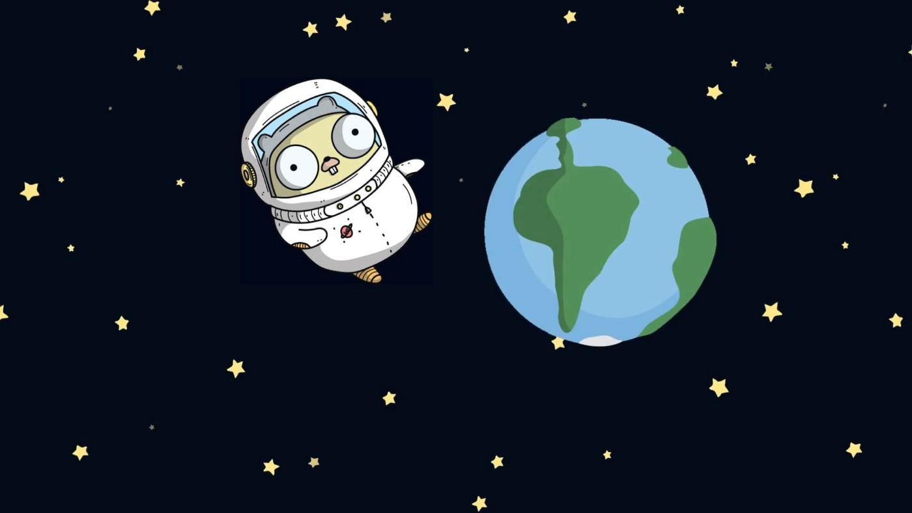
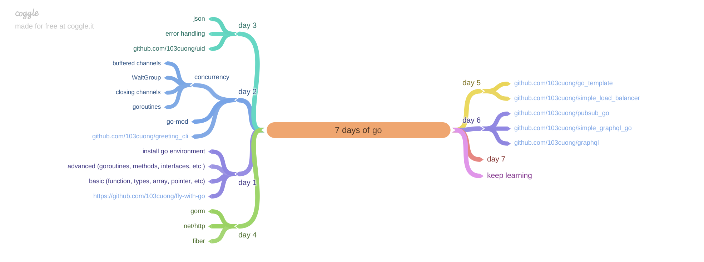

# 7-days-of-go

Learn everything about Go  in 7 days.

*[PDF file](./assets/roadmap.pdf)*

## documents

- [Golang tutorial series](https://golangbot.com/learn-golang-series/)
- [Go Language Advanced Programming](https://zalopay-oss.github.io/go-advanced/)
- [Let's Go: Learn Go in 30 days](https://dev.to/canro91/let-s-go-learn-go-in-30-days-3dg9)
- [Clean Go Code](https://github.com/Pungyeon/clean-go-article)
- [How To Code in Go](https://www.digitalocean.com/community/tutorial_series/how-to-code-in-go)
- [Go cheatsheet](https://devhints.io/go)
- [gophercises - FREE coding exercises for budding gophers](https://gophercises.com/)
- [exercism.io - go](https://exercism.io/tracks/go)

## license

MIT © [Cuong Tran](https://github.com/103cuong)
