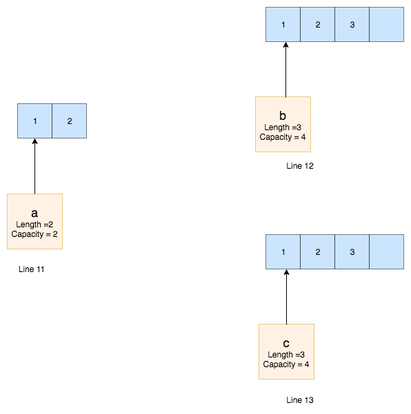
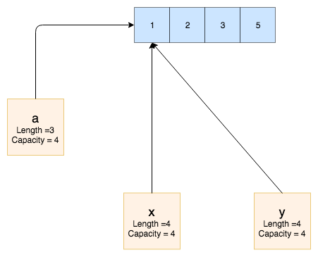
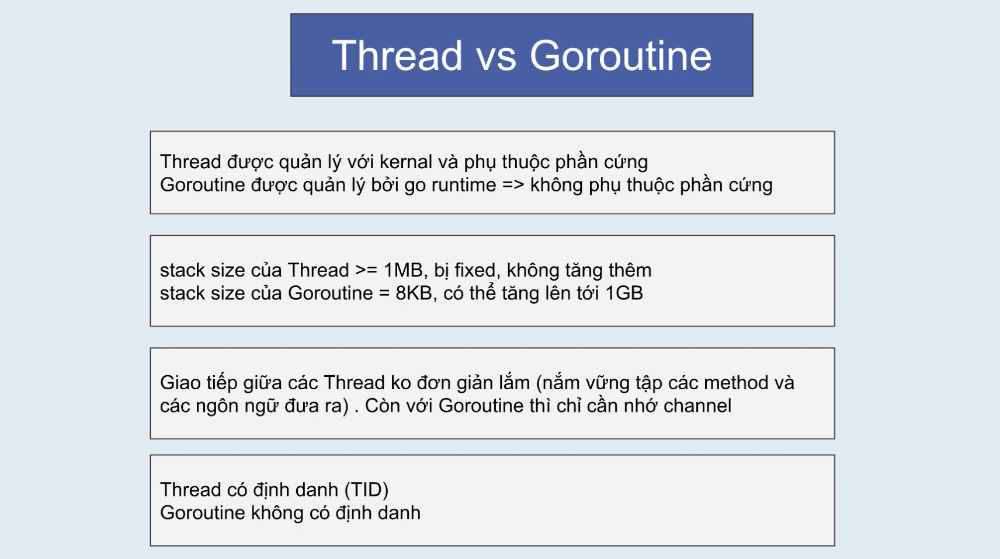

# day 1

## 💻 install Go on Mac (with homebrew)

### install Go

```sh
brew update && brew install golang
```

### setup workspace

```sh
mkdir -p $HOME/go/{bin,src}
```

- src: The directory that contains Go source files. A source file is a file that you write using the Go programming language. Source files are used by the Go compiler to create an executable binary file.
- bin: The directory that contains executables built and installed by the Go tools. Executables are binary files that run on your system and execute tasks. These are typically the programs compiled by your source code or another downloaded Go source code.

### setup environment

```sh
nano ~/.zshrc
```

```sh
# ~/.zshrc
...
export GOPATH=$HOME/go
export PATH=$PATH:$GOPATH/bin
```

```sh
source ~/.zshrc
```

## 📒 notes

### 🥚 basic types

```
bool

string

int  int8  int16  int32  int64
uint uint8 uint16 uint32 uint64 uintptr

byte // alias for uint8

rune // alias for int32
     // represents a Unicode code point

float32 float64

complex64 complex128
```

|  type  	|                    limit                   	|
|:------:	|:------------------------------------------:	|
| uint8  	| 0 – 255                                    	|
| uint16 	| 0 – 65535                                  	|
| uint32 	| 0 – 4294967295                             	|
| uint64 	| 0 – 18446744073709551615                   	|
| int8   	| -128 – 127                                 	|
| int16  	| -32768 – 32767                             	|
| int32  	| -2147483648 – 2147483647                   	|
| int64  	| -9223372036854775808 – 9223372036854775807 	|

### pointer

> A pointer is a variable which stores the memory address of another variable.


#### zero value of a pointer

> The zero value of a pointer is nil.

```go
package main

import (
    "fmt"
)

func main() {
    a := 25
    var b *int
    if b == nil {
        fmt.Println("b is", b)
        b = &a
        fmt.Println("b after initialization is", b)
    }
}
// b is <nil>
// b after initialisation is 0x1040a124
```

> In Go, nil is the **Zero Value** for channels, slices, maps, interfaces, function, and pointer types.

> Zero Value is a default value which is obtained by declaring a variable without initializing it.

### 🎢 slices

#### what is slice?

> A slice is a convenient, flexible and powerful wrapper on top of an array. Slices do not own any data on their own. They are the just references to existing arrays.

> A slice does not own any data of its own. It is just a representation of the underlying array. Any modifications done to the slice will be reflected in the underlying array.

#### length and capacity of a slice

> The capacity of a slice is the number of elements in the underlying array, counting from the first element in the slice.

#### memory allocation of slices

```go
package main

import (
	"fmt"
)

func main() {
	//case 1
	a := []int{}
	a = append(a, 1)
	a = append(a, 2)
	b := append(a, 3)
	c := append(a, 4)
	fmt.Println("a: ", a, "\nb: ", b, "\nc: ", c)

	//case 2
	a = append(a, 3)
	x := append(a, 4)
	y := append(a, 5)
	fmt.Println("a: ", a, "\nx: ", x, "\ny: ", y)

}
// a:  [1 2]
// b:  [1 2 3]
// c:  [1 2 4]
// a:  [1 2 3]
// x:  [1 2 3 5]
// y:  [1 2 3 5]
```

**case1**



**case2**



*👸🏻 [How do slices internally work in golang ?](https://medium.com/@riteeksrivastava/how-slices-internally-work-in-golang-a47fcb5d42ce)*

### goroutines

> Do not communicate by sharing memory; instead, share memory by communicating.



```go
package main

func sum(c chan int, s []int)  {
  sum := 0
  for _, v := range s {
    sum += v
  }
  c <- sum
}

func main()  {
  c := make(chan int, 7)
  s1 := []int{1, 3, 4, 5, 6, 7}
  s2 := []int{7, 8, 9, 10, 11}
  go sum(c, s1)
  go sum(c, s2)

  x, y := <- c, <- c
  println(x, y) // 45 26
}
```

## documents

- [How To Install Go and Set Up a Local Programming Environment on macOS](https://www.digitalocean.com/community/tutorials/how-to-install-go-and-set-up-a-local-programming-environment-on-macos)
- [fly-with-go](https://github.com/103cuong/fly-with-go)


- [Golang for Node.js Developers](https://github.com/miguelmota/golang-for-nodejs-developers)


- [Understanding Go's `nil` value](https://www.gmarik.info/blog/2016/understanding-golang-nil-value/)

- [Học Go cấp tốc Phần 3: Arrays và Slices](https://kipalog.com/posts/Hoc-Go-cap-toc-Phan-3---Arrays-va-Slices)

- [Golang Slices](https://www.golangprograms.com/go-language/slices-in-golang-programming.html)
