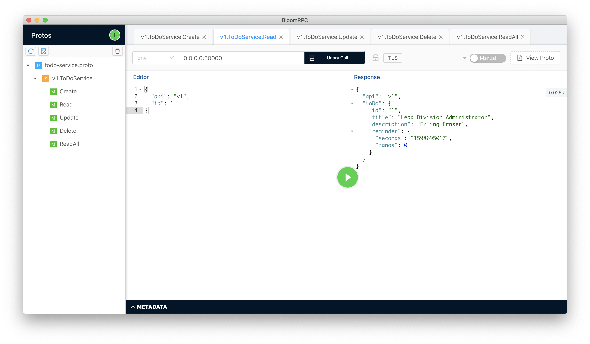

# go_grpc


[](https://goreportcard.com/report/github.com/103cuong/go_grpc)

go 🤝 gRPC

## preparation

- [Go](https://golang.org/)
- [Docker](https://www.docker.com/)
- [protobuf](https://developers.google.com/protocol-buffers)

```shell script
brew install protobuf # MacOS
apt install -y protobuf-compiler # Linux - Ubuntu
protoc --version
```

## how to use?

### starting MySQL

```shell script
./scripts/database/start.sh
```

### starting gRPC server

```shell script
cd cmd/server && go run main.go
```

### staring gRPC client

```shell script
cd cmd/client && go run main.go
```

### using BloomRPC





## documents

- [[Tutorial, Part 1] How to develop Go gRPC microservice with HTTP/REST endpoint, middleware, Kubernetes deployment, etc.](https://medium.com/@amsokol.com/tutorial-how-to-develop-go-grpc-microservice-with-http-rest-endpoint-middleware-kubernetes-daebb36a97e9)
- [[Tutorial, Part 2] How to develop Go gRPC microservice with HTTP/REST endpoint, middleware, Kubernetes deployment, etc.](https://medium.com/@amsokol.com/tutorial-how-to-develop-go-grpc-microservice-with-http-rest-endpoint-middleware-kubernetes-af1fff81aeb2)
- [[Tutorial, Part 3] How to develop Go gRPC microservice with HTTP/REST endpoint, middleware, Kubernetes deployment, etc.](https://medium.com/@amsokol.com/tutorial-part-3-how-to-develop-go-grpc-microservice-with-http-rest-endpoint-middleware-739aac8f1d7e)
- [Go Generated Code](https://developers.google.com/protocol-buffers/docs/reference/go-generated)

## license

MIT © [Cuong Tran](https://github.com/103cuong/)
